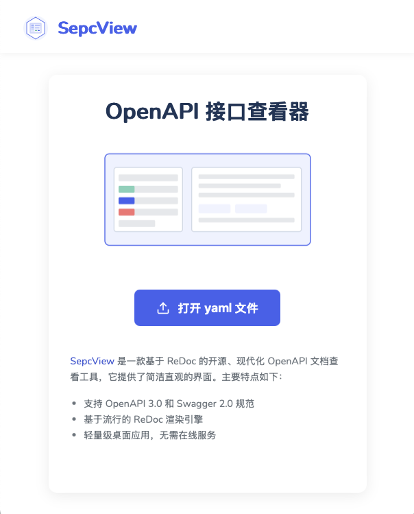

# SepcView

SepcView 是一款基于 ReDoc 的桌面应用程序，专为查看和探索 OpenAPI 规范文档而设计。它提供了简洁美观的界面，让开发者、API 设计师和技术文档团队能够轻松浏览和理解 API 接口规范。
无论您是在开发 API、与团队分享 API 文档，还是学习第三方 API，SepcView 都能提供出色的文档查看体验。



## 功能特点

- ✨ 现代界面：基于 ReDoc 的清晰现代界面设计
- 🚀 高性能：快速加载和渲染大型 OpenAPI 文档
- 📱 响应式设计：适应各种屏幕尺寸的界面布局
- 🔍 强大搜索：快速查找 API 端点和模型定义
- 🔄 实时更新：修改文件后自动刷新预览
- 📊 请求示例：自动生成请求和响应示例
- 🌐 离线支持：完全离线工作，无需互联网连接
- 🔌 多格式支持：支持 YAML 和 JSON 格式的 OpenAPI/Swagger 规范

## 构建过程

```sh
# 事先配置好golang开发环境
# 安装wails
go install github.com/wailsapp/wails/v2/cmd/wails@latest
# 运行调试
wails dev
# 构建应用
wails build
```

## 使用方法

1. 启动 SepcView 应用
2. 点击主界面中的"打开 OpenAPI 文件"按钮
3. 选择您的 OpenAPI 规范文件（YAML 或 JSON 格式）
4. 文档将自动渲染并显示
